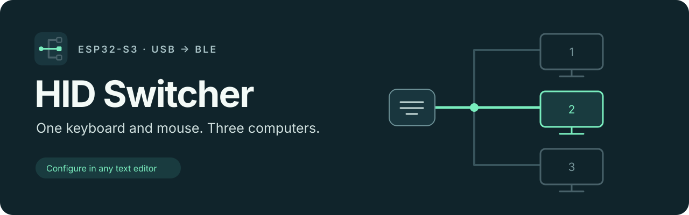
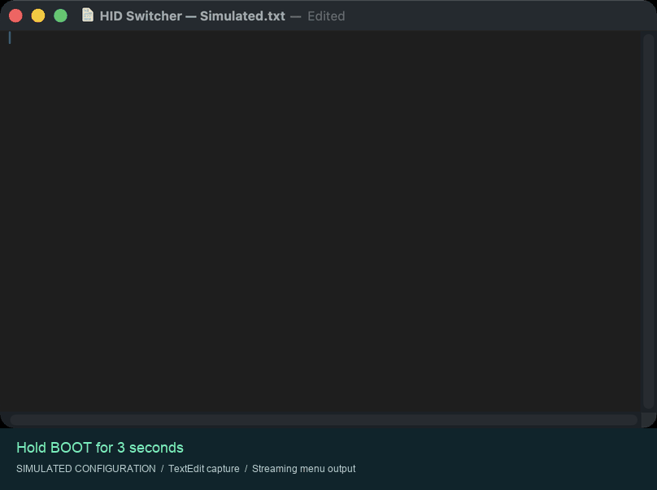

# HID Switcher



Use one USB keyboard and mouse with up to three Bluetooth-enabled computers.

Only the selected computer receives input. The other Bluetooth connections stay open. Names, pairings, and shortcuts stay in memory after a restart.

## Hardware

- Freenove ESP32-S3: 16 MB flash and 8 MB PSRAM.
- USB keyboard and relative HID mouse.
- USB hub, if you connect both devices.

Connect the hub to the native USB/OTG port. Use the UART/COM port for power and firmware installation. Use a powered hub if the board cannot supply sufficient power.

A CH340 USB-to-UART port cannot operate as a USB host.

## Install or update

Identify the correct board and UART port before installation. Use PlatformIO with [platformio.ini](platformio.ini).

```sh
pio run
pio device list
pio run -t upload --upload-port YOUR_UART_PORT
```

All firmware updates use USB. There is no Wi-Fi or web configuration page. An optional macOS companion adds pointer-edge switching; setup remains on the device. The existing partition layout remains compatible with saved settings. Do not erase flash unless you want to remove pairings and settings.

## Connect computers

1. Press Ctrl + Cmd + 1.
2. Pair **HID SWITCHER BLE** in the first computer's Bluetooth settings.
3. Press Ctrl + Cmd + 2.
4. Pair the second computer.
5. Repeat for slot 3, if necessary.

Cmd means Command on macOS or Windows/Super on other keyboards. Left and right modifier keys have the same function.

## Switch at the edge of the screen

An optional [macOS companion](companion/README.md) lets you push the pointer against the right edge to select the next computer, or the left edge to select the previous one. Install it on each Mac from which you want to switch at a screen edge. Disconnected computers are skipped. Slots run left to right as 1, 2, 3. Edge switching stops at either end and does not wrap. Switching does not require a companion on the destination. Push 100 relative mouse counts outward after reaching an edge to switch input; the destination pointer stays where it was.

Shared monitor boundaries stay on the same computer. Dragging, held keys, and the setup menu disable edge switching. Keyboard and mouse shortcuts remain available.

This feature requires the companion and updated firmware. Hardware validation is pending.

## Configure the device



1. Open a blank document in a text editor on the selected computer.
2. Select the US keyboard layout on that computer.
3. Set Caps Lock to off.
4. Hold BOOT for three seconds.
5. Wait for the menu and its `>` prompt.
6. Press a menu number.

The device types the menu into the document. It reads configuration input directly from the attached USB keyboard and mouse. No software installation is necessary.

Use a text editor, not a command shell. Keep the document selected until you exit. The device cannot detect which application receives its text.

| Menu | Function |
| --- | --- |
| Computers | Rename, move, select, or forget a computer |
| Shortcuts | Record, clear, or restore shortcuts |
| Bluetooth name | Change the device name |
| Diagnostics | Show USB status, Bluetooth errors, and report times |

Each configuration menu shows the current settings. Unassigned shortcuts show **Not set**.

Enter names with printable ASCII characters. Press Enter to review a name. Press `y` to save or `n` to cancel. Uppercase `Y` and `N` also work.

Press Escape to go back without saving the current input. Escape at the main menu exits setup. Press BOOT to exit from any screen. The menu also closes after two minutes without input or if its Bluetooth connection is lost. Selecting another computer closes the menu before the switch.

The RGB LED is yellow in configuration mode. Normal keyboard and mouse input stops while the menu is open.

## Shortcuts

| Action | Function | Default | Input device |
| --- | --- | --- | --- |
| Cycle | Next connected computer | Ctrl + Cmd + Tab | Keyboard, mouse, or both |
| Next | Next connected computer | None | Keyboard, mouse, or both |
| Previous | Previous connected computer | None | Keyboard, mouse, or both |
| Slot | Any slot, including disconnected slots | Ctrl + Cmd + 1/2/3 | Keyboard only |

Cycle, Next, and Previous skip disconnected computers and repeat through the slot list. With no other connected computer, selection stays unchanged.

To change a shortcut:

1. Select **Shortcuts** from the menu.
2. Select the action.
3. Select **Record**.
4. Wait for the prompt.
5. Press and release the combination on the attached USB keyboard or mouse.
6. Press `y` to save after the confirmation prompt.

For Slot, record only modifier keys. Use those keys with 1, 2, or 3 to select a slot. Mouse shortcuts can include keyboard modifiers. Wheel and movement gestures are not supported.

**Clear keyboard** and **Clear mouse** remove only the specified input type. Recording one input type keeps the other shortcut. **Restore defaults** resets all shortcuts. Each change requires confirmation.

## Forget a pairing

1. Select **Computers**, then **Forget pairing**.
2. Select the computer's slot.
3. Check the displayed name.
4. Press `y` or `Y` to confirm.

The bridge disconnects that computer and clears its pairing. The slot name, shortcuts, and other pairings stay saved. If you forget the current computer, setup closes when it disconnects. Press Esc or `n` to cancel before removal.

Also forget HID SWITCHER BLE in that computer's Bluetooth settings before pairing again. Select the empty slot to pair a replacement computer.

## Status and recovery

GPIO2 flashes the selected slot number. The RGB LED shows blue/green/purple for slots 1/2/3. A steady light means ready; a flashing light means disconnected.

Initial pairing does not require the menu. Use the default Slot shortcut to select an empty slot. If Bluetooth is unavailable, use UART at 115200 baud: `1`/`2`/`3` selects a slot, `?` shows status, and `u` restarts USB devices.

## Limits and tests

Tested hardware: Moonlander, Logitech MX Master 3S receiver, USB hub, and two Macs. Three simultaneous computers and other operating systems require more tests.

Connect your keyboard and mouse directly or through one USB hub. Hubs cannot be chained together. Keyboards must support sending up to six held keys at once, plus modifier keys such as Ctrl and Shift. Mice with up to eight buttons are supported.

Media keys, touchscreens, and drawing tablets are not supported. Vendor-specific configuration protocols, including HID++, are not supported yet.

Menu text requires the US keyboard layout and Caps Lock off. Normal input does not have this restriction. Diagnostics do not measure total mouse-to-screen delay.

```sh
sh scripts/test-host.sh
pio run
python3 tests/partition-layout.py
```

Host tests cover menu commands, output flow, shortcuts, and input routing. They do not replace tests with physical devices.

See [architecture](docs/architecture.md), [dependencies](DEPENDENCIES.md), and [planned work](TODO.md).
