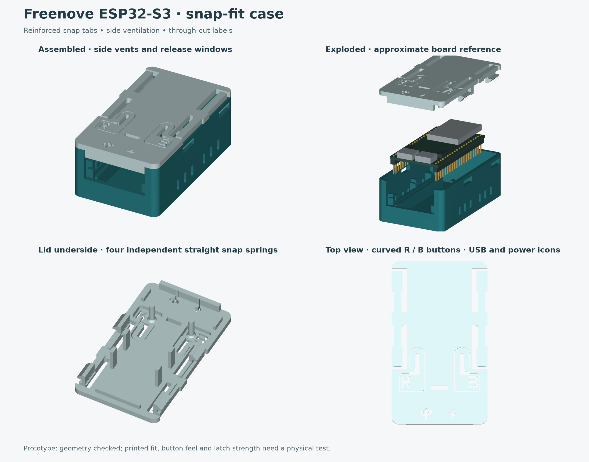

# Freenove ESP32-S3 snap-fit case

Printable prototype for the user's measured 16 MB, no-camera Freenove board with soldered headers. Two parts: a base and a lid with integral BOOT/RESET flexures, downward actuator pegs, four releasable short snap catches behind the buttons. Outside dimensions: **38 × 64.95 × 24.9 mm**. All snap teeth are inside this outline.



## Ventilation and cut-through labels

Twelve vertical rounded **2 × 5 mm** ventilation slots form matching patterns on the lower side walls, six per side. They remain exposed when a hub covers the lid. The slot bottoms are 3.5 mm above the underside; they do not cut the snap pockets or roots. Thermal performance has not been measured.

**R** and a rounded **B** are straight through-cut stencil letters on the moving button tabs, on the outboard part of each rounded paddle at Y=12.8 mm, clear of the actuator peg roots. The B uses two 0.8 mm bridges across its left stem to retain the centres while preserving its rounded lobes.

A **USB trident** identifies the left native USB/OTG connector; a **lightning bolt** identifies the right UART/power/programming connector, viewed with the USB ports toward you. This mapping follows the UART connection illustration on printed page 28 (PDF page 30) of [Freenove's C tutorial](https://github.com/Freenove/Freenove_ESP32_S3_WROOM_Board_Lite/blob/main/C/C_Tutorial.pdf). Both icons are straight through-cuts over their ports, replacing HUB/PWR text.

There is no raised, bevelled or shallow engraved text. The cutouts stay within the button tabs; the surrounding U slots and peg roots remain intact. Clear strings from the apertures after printing. Letter cutouts change the tabs' stiffness, so button feel and fatigue need a physical check.

## Internal snap-fit revision


The previous tall tongues broke almost immediately in the user's PLA print. They are replaced by **four short, solid internal catches**, two per side at Y=23 and 53 mm: **4.5 mm projection** instead of 10 mm, **8 mm width**, **1.6 mm constant thickness**, and **0.6 mm root fillets**. The teeth overlap the base by **2.0 mm**, increased by 0.5 mm from the preceding version. Flat retaining shoulders sit 0.2 mm below the catch roofs. The teeth now reach the outside wall plane through the existing catch windows.

Each tooth now has its **own straight spring**, two per side, replacing the U-return shape. Each spring is now **3.0 mm wide** (previously 1.6 mm), with a **16.5 mm free length**, **1.2 mm plan-view root fillet**, and a **1.6 mm wide × 0.8 mm deep underside reinforcing rib**. The rib sits inside the base wall and increases the local section depth from 2.4 to 3.2 mm. This revision targets infrequent opening and firmer lid retention, rather than an easy-release feel. Front and rear springs attach independently to rigid roof near the middle of each side. The four teeth extend 0.5 mm farther outward into the existing windows, with 2.4 mm inward relief for 2.2 mm release movement. The R/B button springs retain their curves.

CAD verifies four separate spring attachments and nominal catch clearance, not printed stiffness or fatigue. A temporary root-severing check detaches four separate spring-and-tooth pieces.

**This stiffness revision needs only a new lid.** The base and R/B buttons are unchanged; the snap springs are reinforced and the four teeth extend 0.5 mm farther outward. All zip-tie slots have been removed, leaving solid roof around the spring roots. The base has four **9 × 3 mm** through catch windows near the seam. The rear pair remains at Y=53 mm. Push the teeth inward through these windows while lifting evenly.

Optional `snap-test-base.stl` and `snap-test-lid.stl` are cropped mating sections for checking insertion, tooth return and release before another full print. They preserve the latch geometry and print orientations but do not reproduce complete-case stiffness or hub loads. Do not infer full-case strength from the coupons.

Both header channels and their housing guides move **0.55 mm outward per side** after the latest printed fit showed the channels were 1 mm too close together. Their modelled centre spacing is now **24.5 mm**, increased from 23.4 mm. This uses the latest approximate 24.5 mm measurement, interpreted as row centre-to-centre spacing. Fore-and-aft clearance is now 0.1 mm total (0.05 mm per end), down from 0.3 mm. The end stops extend up to the PCB edges rather than locating only the assumed header-plastic ends. This closer fit needs a physical check; do not force the PCB if print tolerances close the gap. Side locators allow 0.15 mm per side. Tapered guide ribs locate the Dupont plastic housing; the 1.2 mm pin channels leave clearance around the metal contacts. This is a close sliding fit, not an intentional interference fit that bends pins. Header plastic width is still modelled as 2.54 mm.

The prior PLA improvements remain: 1.6 mm bearing rails/end fences, substantial lid hold-down ribs (now 1.5 × 3.2 mm, repositioned for the moved headers), 2.6 mm pegs, rounded slot ends, and 45-degree button-stop ramps in the base. Each button now has a shorter 2.0 mm thick U-return spring with 2.0 mm legs and 2.8 / 0.8 mm outer / inner bend radii. The bend moves forward 4 mm to Y=23.5 mm. The surrounding cutout follows the rounded paddle and rounded spring end with 0.4 mm perimeter clearance, replacing the large rectangular opening, joining a rounded paddle. The side root is rounded and thickened to match. The paddles remain 1.2 mm thick so their stop contact stays unchanged. The peg centres, rest gaps and supported travel stops remain unchanged. Printed fit, button force and repeated latching need another prototype.

## Files

- `base.stl`: print flat bottom down, as exported.
- `lid.stl`: print flat exterior face down, pegs/hooks pointing up, as exported.
- `case.step`: editable assembled case geometry.
- `board-reference.step`: approximate clearance reference, not a printable case part.
- `board.json`, `generate.py`, `preview.py`: measured inputs, parametric CAD and actual-geometry renderer.
- `validation.json`: solid, mesh, assembly, insertion and clearance checks.
- `slicer-validation.json`: Bambu Studio slicing smoke-check result and input hashes.

## Measurements and allowances

User caliper measurements are recorded in `board.json`. X measurements start at the left PCB edge, with USB ports toward the viewer. CAD X=0 is the board centreline. Y=0 is the USB-end PCB edge, not the connector face. See [measurement diagram](measurements.svg).

| Feature | Nominal allowance |
| --- | --- |
| Main PCB location | 0.15 mm each side; 0.05 mm each end |
| Pin tips above floor | 1.15 mm |
| Pin channel | 1.2 mm wide for a measured 0.65 mm pin (0.275 mm clearance per side) |
| Board vertical retention | 0.25 mm above PCB at hold-downs |
| Button peg rest gap | 0.5 mm above unpressed switch |
| Button flexure | Short U-return, 2.0 mm thick, 2.0 mm legs; 1.2 mm paddle |
| Button travel stop | Base wall ramp under outer paddle, 1.2 mm tab travel; switch travel itself is unmeasured |
| Lid locating lips | 0.3 mm from inner wall |
| Snap hooks | 2.0 mm engagement, entry ramp, internal catches and inward release |

A common 27.6 × 10.2 mm opening accommodates both USB connectors and cable overmoulds. Cable overmoulds were not measured; check your actual plugs. USB centres, shell widths/heights and zero protrusion use the supplied measurements. USB shell depth and module footprint remain approximate; overall component height uses the supplied 3 mm maximum (USB shell separately 3.1 mm).

## Printing and assembly

This revision targets PLA. Use your calibrated PLA profile; printed PLA still has limited flexure fatigue life. Suggested starting settings: 0.4 mm nozzle, 0.2 mm layers, 4 walls, 5 top/bottom layers, 20–30% infill. These are prototype settings, not mechanically validated. Preserve the exported orientations and print at 100% scale.

The base cable opening is open at the top, avoiding a long bridge. The button stops are now supported 45-degree base ramps, not lid bridges.  Avoid supports in the button slots. Keep seams off flexure roots and snap ramps where practical.

1. Remove strings and elephant-foot burrs, especially around the button and snap reliefs.
2. Check that the four spring reliefs are free of strings.
3. Drop the board into the base, USB ports at the opening. Header plastic rests on the rails; pins sit in the channels. The header centres are now 24.5 mm apart based on the approximate measurement; do not force the board if it does not seat.
4. Lower the lid squarely and engage all four catches. Confirm both buttons are released at rest and can be pressed individually. Trim pegs slightly if the switches are preloaded; regenerate longer pegs if they cannot reach. Stop if button force rises sharply.
5. Gently move each internal tooth inward about 2.2 mm through its release window, then lift the lid. Lift evenly rather than pulling hard on a single corner.

## Verification

Both STL meshes are watertight, consistently wound, single connected parts on Z=0. The CAD checks found no interference between the assembled case and nominal board envelopes, through the board's vertical insertion path, or at sampled ±0.14 mm X and ±0.04 mm Y board offsets. Retaining-shoulder probes catch after 0.35 mm of upward movement and clear the wall after 2.2 mm inward release. The shoulders also catch with 0.4 mm of simulated engagement loss. These are geometry checks, not a spring simulation. These checks cover the modelled geometry, not unknown components, cable bodies or material deformation.

Bambu Studio 02.08.02.61 successfully sliced both case STLs and both snap-test coupons on one X1 Carbon 0.4 mm plate at 0.2 mm layers, using four walls, 25% infill, five top/bottom layers, supports disabled, and the Generic PLA preset. The CLI returned success with no warnings. This is a slicing smoke check, not a physical bridging/strength test. No printer was contacted. Generated G-code is not distributed; slice for your own printer and filament.

The user physically tested the preceding internal-snap version and reported that the tall teeth broke almost immediately. This revised version has not been physically tested; latch strength, tooth return, closer housing fit remain to be checked.

## Regenerate

```sh
uv venv /tmp/hid-case-cad-venv --python 3.11
uv pip install --python /tmp/hid-case-cad-venv/bin/python -r stls/requirements.txt
/tmp/hid-case-cad-venv/bin/python stls/generate.py
/tmp/hid-case-cad-venv/bin/python stls/preview.py
```

The generator stages its outputs and publishes only after all geometry checks pass. Re-run slicing after any geometry change; `slicer-validation.json` records hashes to identify the exact checked STLs.

## References

User caliper measurements supersede photo estimates. [Manufacturer listing](https://store.freenove.com/products/fnk0099) and [pinout](https://github.com/Freenove/Freenove_ESP32_S3_WROOM_Board_Lite/blob/main/ESP32S3_Lite_Pinout.png) identify the layout. The [user-supplied MakerWorld mockups](https://makerworld.com/en/models/1625563-freenove-esp32-s3-wroom-model-files#profileId-1716334) include the Lite variant; their author adds component and GPIO clearance. The listing was inspected, but its mesh was not imported or redistributed. The approximate board reference here is built independently from measurements and simple envelopes.
